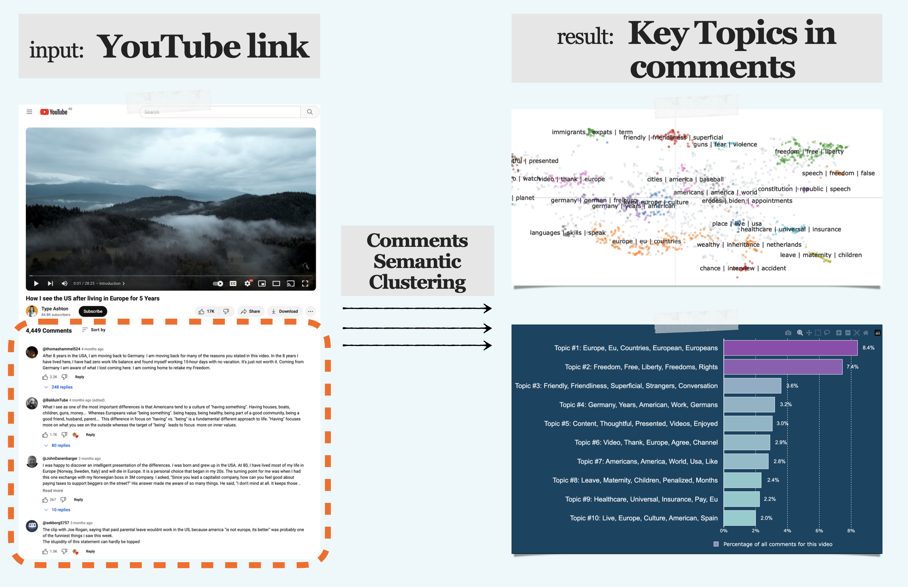
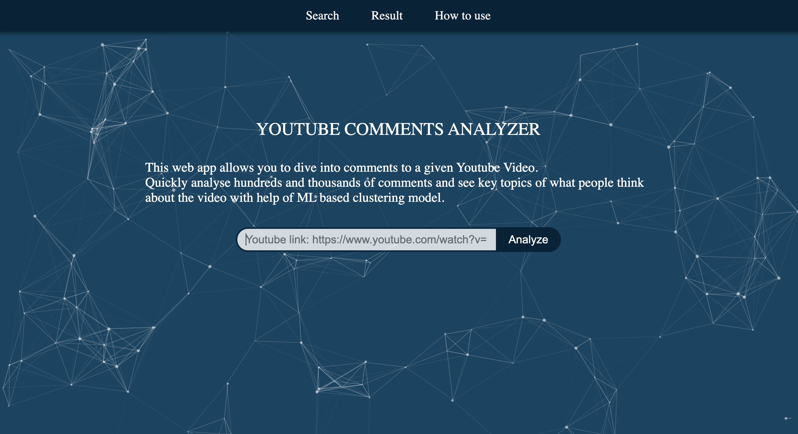
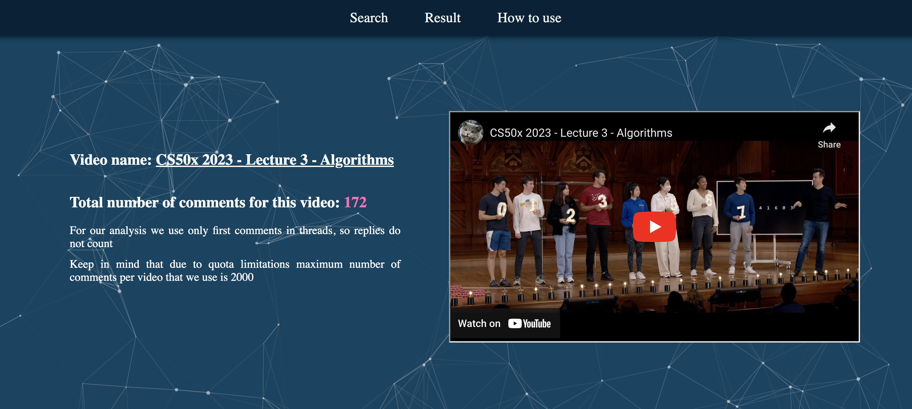
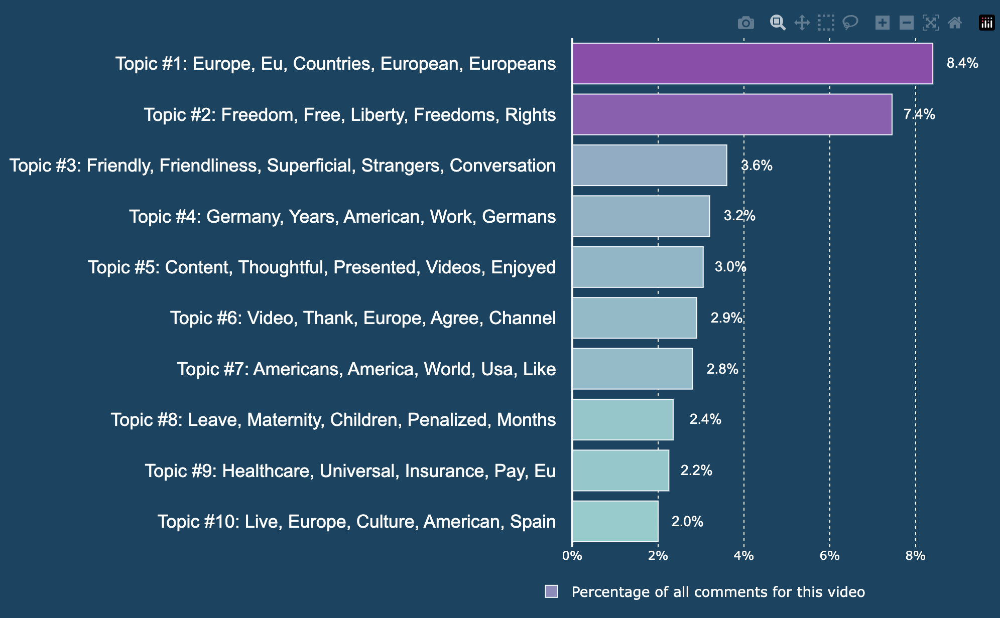
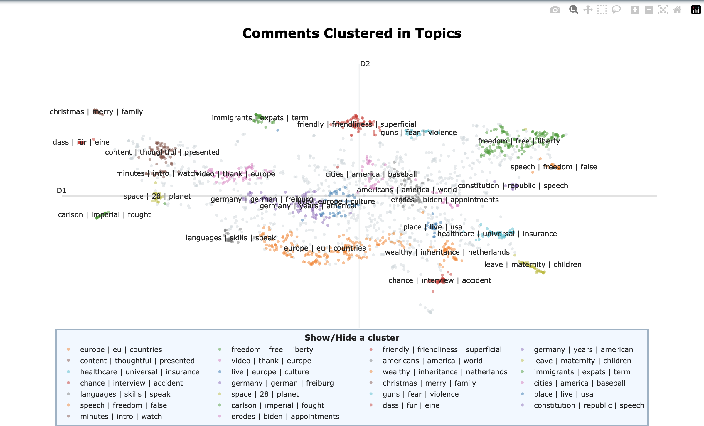
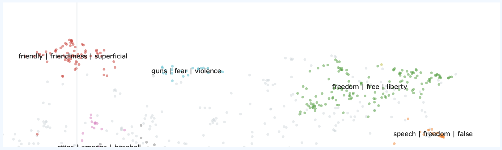

# YOUTUBE COMMENTS ANALYZER

This web app lets you analyze thousands of comments on a YouTube video, revealing key topics using a semantic similarity ML model.




Video Demo: https://www.youtube.com/watch?v=QOt2XtJAIzU

## Summary
In brief, this app leverages the YouTube API to retrieve comments for a specified video, employs the [BERTopic](https://github.com/MaartenGr/BERTopic/) algorithm for topic modeling, and utilizes Flask to transform it into a web app.

It consists of the following modules:
- **app.py** | Here are Flask app, session configuration and all the routes (`/`, `/lastresult`, `/howtouse`).<br><br>
- **parse_yt_comments.py** | Here I set up YouTube API Request in order to get comments for a video provided by user. Comments attributes such as author name, number of likes, number of replies and some other are also collected at that stage. `youtube_parse_name(link)` returns Pandas dataframe with all the received comments info, while `youtube_parse_name(link)` checks (again using API) whether link for a video is valid and if so - returns its name.<br><br>
- **cluster.py** | This module is to train BERTopic model on comments, with different components that this algorithm consists of - starting with [sentence_transformers](https://www.sbert.net/docs/pretrained_models.html) model "all-MiniLM-L6-v2" to make embeddings from comments. After customized BERTopic model is fit on our data and clusters (topics) are generated, topics info is stored in a dataframe. `.visualize_documents` method is used to produce a `plotly` figure with comments and topics, that is then stored in a python variable. Also, in this file here are some helpers-functions (`customize_topics_labels_for_table()`, `customize_topics_labels_for_barchart()`) that enhance a little bit topics names representation. `min_number_of_comments_for_cluster(n)` function  determines how small any cluster can be, more on that - [here](#mts).<br><br>
- **barchart.py** | Here I build a `plotly` bar chart illustrating top 10 most frequent topics revealed by the model.<br><br>
- **ram_monitor.py** | Optional module that I use to see how much RAM is used by the service (primarily by BERTopic model) and to check how it differs among different cases (small vs large samples of comments).

For more details about algorithm part please check [this section](#anchor_tech).

## BERT model and limitations <a id="anchor_tech"></a>

### Model choice
For natural language processing task that this app implies, one popular aproach is using pre-trained BERT models fine-tuned for sentence similarity from `sentence-transformers` [library](https://www.sbert.net/). Among the variety of models they have, ["all-MiniLM-L6-v2"](https://www.sbert.net/docs/pretrained_models.html) has proved to be effective in terms of speed, size and consistency. However, given the continuous advancements in models, I also plan to explore and integrate more optimal [models](#multi) in the future.

The selected BERT model serves as a key component in generating embeddings for texts within the [BERTopic algorithm](https://maartengr.github.io/BERTopic/algorithm/algorithm.html). Additionally, BERTopic offers a range of visualization tools and customization options, such as `vectorizer_model`, `representation_model`, which contribute to the overall quality of topics produced by the app.


### YouTube API Quota limitations
As of now, the free quota limit is 10,000 units per day, which equates to retrieving 1,000,000 comments per day
(if you use maximum allowed value `100` for `maxResults` parameter when setting up [the API request](https://developers.google.com/youtube/v3/docs/commentThreads/list)). 
Therefore, in order not to exceed the quota, a limiter is employed. I utilize the
`MAX_NUMBER_OF_COMMENTS_TO_PARSE` limiter in `parse_yt_comments.py`. This variable is currently set to 2,000 (0,2% of the daily quota).

This limitation is significant not only in terms of API quota but also for:
- **Topics quality**. From my experience, increasing the comment sample size to, for instance, 5,000 or 10,000 does not notably enhance the diversity of received topics for a given video.
- **Algorithm processing time** (overall speed). The most resource-intensive part is the preparation of embeddings, which takes ~30 sec for 2,000 comments on my local machine. So, increasing the limit would make the app work slower and less user-friendly.

### Dynamic min_topic_size <a id="mts"></a>

As [specified](https://maartengr.github.io/BERTopic/getting_started/parameter%20tuning/parametertuning.html#min_topic_size) by BERTopic author, min_topic_size i.e. minimum size of a topic (cluster) is an important parameter for this model, because:
>If you set this value too high, then it is possible that simply no topics will be created! Set this value too low and you will get many microclusters.

So basically, we should tune this parameter based on sample size, e.g. given a sample of 10,000 documents, we can find the optimal value by trial and error looking at clusters generated. But in case of this app, where number of comments to a video can vary from 100 up to `MAX_NUMBER_OF_COMMENTS_TO_PARSE`, any hard value does not work well. 

In order to overcome this limitation, we need a dynamic value based on number of comments. Empirically, I came to the formula below for this task:

```python
def min_number_of_comments_for_cluster(n):
    k = int(round(numpy.log(n) + n/500))
    print(f'min comments per cluster: {k}')
    return k
```

It's probable that this solution isn't optimal, but it gets the job done. For instance, if we have a video with 100 comments, one topic could comprise as few as 5 comments, which I find quite appropriate. With 2,000 comments, each topic would consist of minimally 12 comments, ensuring we don't end up with "microclusters" of just 6-7 comments.

## Web Pages Overview
### Search
On this page, users are prompted to paste a YouTube video link for comment analysis:


The search field incorporates a two-level validation to ensure the user inputs a valid YouTube link.
If the provided text does not resemble a YouTube link (e.g., lacks "youtube"), a prompt message is displayed. Then, if the text resembles a YouTube link but fails the `youtube_parse_name(link)` validation check, a message indicating that the link is invalid appears beneath the search bar.

Once the link passes validation, a loader animation accompanied by a "wait up to 30 sec" message appear.

### Result
After the topic model completes its work, the user is redirected to the result page. All the necessary data for that page, including plots and tables, is stored in the user's session for later access.

At the top of the page, basic information about the video is displayed, including its name and an embedded video player, along with a table showing the top 10 liked comments.



The main section of the page features a bar chart displaying the main topics and their frequency among all comments, as well as a plot showing all the comments clustered into topics. This interactive plot allows users to zoom in, view the text of comments when hovering over them, and download the plot as a PNG file. The legend also enables users to isolate selected topics. For example of how the plots appear, please check *Understanding the result* section [here](#htu_copy). 

Towards the bottom of the page, there is a table listing all the topics revealed along with the number of comments in each topic and representative comments (three per topic).


### How to use
This page provides a demonstration to illustrate what the results may look like and what insights we can get from various generated plots.

I included the information from this page (including FAQ section) down [below](#htu_copy) as it offers a clear example and effectively explains app's purpose.

### How to use (page copy) <a id="htu_copy"></a>

#### Understanding the result

Let's see how we can get interesting findings from our comments analysis.
For demonstration we'll take this video:
<a href="https://www.youtube.com/watch?v=tEeHv5NQtJo">How I see the US after living in Europe for 5 Years</a>

In this video the author describes her feelings about living in Europe compared to the US. Video topic itself is quite debatable theme, so let's see what people in comments think about it. We analyze 2000 comments, and receive 27 clusters (i.e. topics) of semantically close comments (i.e. clusters of comments where people discuss same things or express similar opinions).

So, to start with we can have a look at most popular topics found in comments for a given video. <b>Each topic name consists of the 5 most significant words for this cluster</b>, that is, words that are often found in comments in this cluster and probably rarely in other clusters:



We see that, as it would be logical to assume from the title even without watching the video, that first of all people in the comments discuss Europe (European etc) and the USA (American etc). But already the second cluster is of some interest - we see that topic #2 when comparing life in the USA and Europe is Freedom, Liberty, Rights. Then there are several topics that are very vague (like topics #5 and #6, where people simply express gratitude for the video, and which is unlikely to be of interest to us in the future).

But also we see much more specific topics to discuss. So, topic #3 contains comments discussing the friendliness of people. Topic #8 is devoted to maternity leave, while #9 is about the healthcare system and insurance.

Thus, in this example, <b>we essentially got nothing less than a set of priority criteria or differences</b> by which people in the comments compare life in the USA and Europe.

#### Analyzing topics

But let's go deeper and see our comments in a "map" of topics. This graph not only allows us to see all the topics identified by the algorithm, but also to read each comment that fell into one cluster or another (gray color shows comments that could not be classified into any cluster). We can also see how close certain topics are to each other. The control panel in the upper right part allows you to zoom in on different sectors of the graph, save it as an PNG, and the names of the topics on the legend allow you to view the selected cluster isolated:



So here we can see a bunch of other topics that we could add to the "criteria list" above, for example topic about immigrants and the one about wealth.

If we zoom in and analyze the distances and location of the “comment clouds” on the graph relative to each other, we can see that a heated discussion about “freedom of speech” is naturally located next to the topic about freedom in general. While quite surprisingly the theme of “guns, fear, violence” is adjacent to “friendliness”:



It may also be of interest and convenience, that it seems like topics focusing on tha USA (such as discussed above and "baseball, "biden", "constitution") tend to lie to the right of Y-axis, while those focusing on Europe - including Germany specifically and "languages, skills" - are more likely to be on the left side.

Of course, if any of the topics arouses your interest, then you can quickly get an idea of what opinion on this issue prevails among viewers by pointing to individual comments in the cluster.

#### Conclusion

In this example, we saw how, using this web service, you can quickly analyze comments under a single video and perhaps get some insights about which topics are most actively discussed without having to scroll through thousands of comments manually. Of course, not every video shows such interesting and lively discussions and polar opinions, so feel free to experiment!

#### User FAQ <a id="faq"></a>

<details>
<summary>How it works?</summary>
<br>
For each comment in a sample we get its <b>embedding</b> (using BERTopic algorithm), and then based on distance between embeddings clusters are generated. So, similarity of comments in this context is all about semantics: it is calculated only based on their sense and similar words they have in common (and does not depend on author attributes, time, number of likes etc). For each cluster we take top-5 meaningful words, that form a topic name.
</details>
<br>
<details>
<summary>More about algorithm</summary>
<br>First of all, comments under given video are parsed using YouTube API. Then BERTopic algorithm is used, that we train on a sample of comments in order to get topics. <br><br>BERTopic algorithm in turn consists of several steps, first of them - to embed given comments using pre-trained <a href="https://www.sbert.net/docs/pretrained_models.html">sentence-transformers model "all-MiniLM-L6-v2"</a>. Then - to cluster comments - i.e. to find groups of similar comments embeddings, HDBSCAN algorithm is used (default clustering algorithm in BERTopic). To achieve optimal number of clusters for each sample we use different minimal topic size, which is determined based on number of comments parsed (the larger a sample, the higher minimum number of comments is required for cluster to be formed). CountVectorizer is then used with stop_words=“english” parameter as we want to avoid uninformative words like (“and”, “the”, “him”) in our topic representation words, and Maximal Marginal Relevance algorithm with diversity=0.4 is used to reduce a little bit the number of duplicate words in our topics. <br><br>If you want to go deeper, please visit wonderful <a href="https://maartengr.github.io/BERTopic/algorithm/algorithm.html">BERTopic page</a>.
</details>
<br>
<details>
<summary>Optimal number of comments for analysis</summary>
<br>
Empirically it usually works best on videos with <b>1000+ comments</b>. However, value of the resulting topics depends not only on the number of comments, but also on how much they differ, so the most informative results are obtained on videos under which there are discussions of different topics or polar opinions, even though they may have relatively small number of comments.
</details>
<br>
<details>
<summary>For whom this may be helpful?</summary>
<br>
Whether you are a content-maker who wants to save time analysing comments under your videos, or let's say you make some marketing and want to check information about a product that has video review about it - you are welcome to almost instantly find aggregated topics/opinions discussed in comments under Youtube video using this web-service.
</details>
<br>
<details>
<summary>Does it work with languages other than english?</summary>
<br>
As of now, it only works well with comments in English, so if you try it on video with mostly non-english comments then you'll probably get just single uninformative topic with all comments on that other language. However, I have plans to integrate multilingual model as well, so stay tuned.
</details>
<br>
<details>
<summary>Why my results differ from time to time for the same video?</summary>
<br>
Due to stochastic nature of the clustering algorithm results indeed may differ a little bit in different runs. It allows you to experiment until you get the topics that look best to you, though empirically for videos with good number of comments (>1000) results are pretty consistent.
</details>
<br>
<details>
<summary>Can I see my previous results?</summary>
<br>
As for now, you can only access your last generated result - based on the last video that you searched for.
</details>
<br>
<details>
<summary>Why does it take so long?</summary>
<br>
Time it takes depends on number of comments parsed, so for video with 2000 comments parsed it takes ~30 sec (and most of this time is required for calculation of comments embeddings). <br><br>If you're in hurry and just want to try it fast, you can try it on a video with small number of comments (less than 100), in that case it'll be much faster.
</details>
<br>

## Areas for Improvement

Here are some features and enhancements that I plan to implement in the future:
- **Employing a Database**: This would enable more accurate storage of user search requests and generated results, easily allowing users to access not only the latest result but also previous ones.
- **Implementing Multilingual BERT Model**  <a id="multi"></a> : Integrating a multilingual model, such as `paraphrase-multilingual-MiniLM-L12-v2`, would enable the analysis of comments in languages other than English. However, this model is of higher size and lower speed, so it may be better to add a button on the search page for users to choose whether they need multilingual support for their video.
- **Making the App Mobile Adaptive**: Adapting the application for mobile devices would enhance user experience on various screen sizes.
- **Allowing User to Download Labeled Data**: Providing users with the option to download all comments clustered by topics in CSV would enable further analysis or integration with other tools.
- **Enhancing Topic Model**: Experimenting with BERTopic components, such as trying different clustering techniques besides default HDBSCAN, [lightweight model](https://maartengr.github.io/BERTopic/getting_started/tips_and_tricks/tips_and_tricks.html#gpu-acceleration) for deployment on servers with limitations, [smart merging](https://maartengr.github.io/BERTopic/getting_started/topicreduction/topicreduction.html#topic-reduction-after-training) of very similar topics, and adding a feedback option (grade) on the result page to understand whether a user is satisfied with the value of generated topics.
- **Incorporating Additional Data**: Utilizing other comments data, such as the number of likes or replies, as weights for clustering, and including replies' texts, could improve clusterization accuracy.
- **Detecting Fake Comments**: Detecting the percentage of fake comments under a video, based on overall topic similarity or similarity within particular topics, could help identify bot-generated comments.


